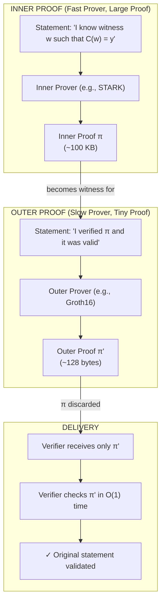

# Chapter 22: Composition and Recursion

Could you build a proof system that runs forever? A proof that updates itself every second, attesting to the entire history of a computation, but never growing in size?

The idea sounds impossible. It requires a proof system to verify its own verification logic, to "eat itself." For years, this remained a theoretical curiosity, filed under "proof-carrying data" and assumed impractical.

This chapter traces how the impossible became routine. We start with **composition**: wrapping one proof inside another to combine their strengths. We then reach **recursion**: proofs that verify themselves, enabling unbounded computation with constant-sized attestations. Finally, we arrive at **folding**: a recent revolution that makes recursion cheap by deferring verification entirely. The destination is IVC (incrementally verifiable computation), where proofs grow with time but stay constant-sized. Today's zkEVMs and app-chains are built on this foundation.

No single SNARK dominates all others. Fast provers tend to produce large proofs. Small proofs come from slower provers. Transparent systems avoid trusted setup but sacrifice verification speed. Post-quantum security demands hash-based constructions that bloat proof size. Every deployed system occupies a point in this multi-dimensional trade-off space.

But here's a thought: what if we could *combine* systems? Use a fast prover for the heavy computational lifting, then wrap its output in a small-proof system for efficient delivery to verifiers. Or chain proofs together, where each proof attests to the validity of the previous, enabling unlimited computation with constant verification.

These ideas, **composition** and **recursion**, transform SNARKs from isolated verification tools into composable building blocks. The result is proof systems that achieve properties no single construction could reach alone.

## Composition: Proving a Proof Is Valid

**Composition** means proving that a proof is valid. You have a proof $\pi$ of some statement. Verifying $\pi$ is itself a computation. You can express that verification as a circuit and prove *that* circuit was satisfied. The result: a proof about a proof.

Why do this? Different proof systems have different strengths. A STARK proves quickly but produces a 100KB proof. Groth16 produces a 128-byte proof but proves slowly. What if you could have both: prove quickly with a STARK, then wrap the result in Groth16 for compact delivery?

This is exactly what composition achieves. The STARK handles the heavy lifting (proving the original computation). Groth16 handles the packaging (proving the STARK verifier accepted). The final recipient sees only the tiny Groth16 proof.

### Inner and Outer

The names **inner** and **outer** describe the nesting:

- The **inner proof** is created first. It proves the statement you actually care about ("I executed this program correctly," "I know a secret satisfying this relation").

- The **outer proof** is the wrapper, created second. It proves "I ran the inner verifier and it accepted."

The verifier of the outer proof never sees the inner proof or the original witness. They see only $\pi'$ and check that it's valid. If the outer system is zero-knowledge, nothing leaks about $\pi$ or $w$.

Think of it like nested containers: the inner proof is a large box containing detailed evidence. The outer proof is a small envelope containing a signed attestation that someone trustworthy opened the box and verified its contents. Recipients need only check the signature on the envelope.

### Complementary Strengths

Now let's be precise about what composition can achieve. Imagine two SNARKs:

**Inner SNARK $\mathcal{I}$** (fast prover, large proofs):

- Prover time: $O(|C|)$, linear in circuit size
- Proof size: $O(\sqrt{|C|})$, sublinear but not constant
- Verification time: $O(\sqrt{|C|})$
- Example: STARK-like systems

**Outer SNARK $\mathcal{O}$** (slow prover, tiny proofs):

- Prover time: $O(|C| \log |C|)$, superlinear
- Proof size: $O(1)$, constant
- Verification time: $O(1)$
- Example: Groth16

The composed system $\mathcal{F} = \mathcal{O} \circ \mathcal{I}$ inherits the best of both:

- Prover time close to $\mathcal{I}$'s (fast)
- Proof size close to $\mathcal{O}$'s (tiny)
- Verification time close to $\mathcal{O}$'s (instant)

How does this work?

## The Composition Construction

The key insight: verification is itself a computation, and computations can be proven.

**Step 1: Run the inner prover.** The prover executes $\mathcal{I}$ on the original circuit $C$ with witness $w$, producing proof $\pi_I$. This costs $O(|C|)$ time.

**Step 2: Arithmetize the inner verifier.** The verification algorithm $V_I$ of the inner SNARK is a computation: it reads the proof, performs some checks, outputs accept or reject. Express this verification as a circuit $C_{V_I}$:

- Public inputs: the original statement $x$
- Witness: the inner proof $\pi_I$
- Output: 1 if $V_I$ accepts, 0 otherwise

The verifier circuit $C_{V_I}$ is much smaller than $C$. If $\mathcal{I}$ has $O(\sqrt{|C|})$ verification time, then $|C_{V_I}| = O(\sqrt{|C|})$.

**Step 3: Run the outer prover.** The prover executes $\mathcal{O}$ on the verifier circuit $C_{V_I}$, using the inner proof $\pi_I$ as the witness. This produces the final proof $\pi_O$.

**Step 4: Deliver only the outer proof.** The prover discards $\pi_I$ and sends only $\pi_O$ to the verifier. The inner proof was a means to an end; it never leaves the prover's machine.

**Step 5: Verify.** The end verifier runs $V_O$ on $\pi_O$, a constant-time operation for Groth16-like systems. They never see $\pi_I$.

### Addressing the Obvious Questions

**"Doesn't proving twice defeat the purpose?"**

Yes, the prover does more total work than using either system alone. But the work is *distributed* strategically:

- The expensive part (proving the original $N$-gate circuit) uses the *fast* inner prover: $O(N)$ time.
- The slow outer prover only handles the tiny verifier circuit: $O(\sqrt{N})$ gates.

The outer prover's $O(\sqrt{N} \log \sqrt{N})$ work is negligible compared to the inner prover's $O(N)$. For a million-gate circuit, the inner proof might take 5 seconds; wrapping it takes 0.1 seconds. Total: 5.1 seconds, dominated by the fast system.

**"What about the witness?"**

The original witness $w$ is used only in Step 1. The outer proof's witness is $\pi_I$ (the inner proof), not $w$. The outer system proves "I possess a valid inner proof," not "I know the original witness."

This is crucial: the outer circuit doesn't re-check the original computation. It only checks that $V_I(\pi_I) = \text{accept}$. The witness $w$ is not needed for verification at any stage. It's consumed entirely during inner proving and never appears again. If the application requires revealing $w$ (or parts of it), that's a separate choice; the proof system doesn't require it.

The soundness chain is:

$$\pi_O \text{ valid} \implies \pi_I \text{ valid} \implies w \text{ satisfies } C$$

The outer proof *transitively* guarantees the original statement, without directly involving $w$.

**"What gets delivered: one proof or two?"**

One proof: only $\pi_O$. The inner proof $\pi_I$ is consumed during composition and never transmitted. This is the entire point: $\pi_I$ might be 100KB, but $\pi_O$ is 128 bytes. The verifier sees only the small envelope, not the large box inside it.

**"This sounds too good to be true. What's the catch?"**

There are catches, and they're significant. The analysis above assumed the inner verifier circuit $C_{V_I}$ is small and easy to express in the outer system. But what if the inner and outer systems speak different languages? STARKs operate over one field; Groth16 operates over another. Encoding foreign field arithmetic can blow up the verifier circuit by orders of magnitude. Trusted setup requirements, field mismatches, and post-quantum concerns all constrain which combinations actually work. The later sections on **The Verifier Circuit Problem** and **Curve Cycles** address these issues in detail.

### The Cost Analysis

Let $|C| = N$ be the original circuit size.

- **Inner proof time:** $O(N)$ from the fast inner prover
- **Verifier circuit size:** $|C_{V_I}| = O(\sqrt{N})$
- **Outer proof time:** $O(\sqrt{N} \log \sqrt{N})$ from the slower outer prover
- **Total prover time:** $O(N) + O(\sqrt{N} \log N) \approx O(N)$

The total is dominated by the fast inner prover. The slow outer prover contributes negligibly because it only processes the small verifier circuit.

**Proof size and verification:** Both inherit from $\mathcal{O}$: constant, tiny, fast.

### A Concrete Example

Circuit size: $N = 10^6$ gates.

Without composition, running Groth16 on the full circuit might take 5 minutes. The prover performs $10^6$ expensive operations (multi-scalar multiplications, FFTs).

With composition:

- Inner SNARK (STARK-like): 5 seconds to prove, produces a proof that the verifier can check in $\sim 1000$ operations
- The verifier circuit $C_{V_I}$ has $\sim 1000$ gates
- Outer SNARK (Groth16): 1 second to prove a 1000-gate circuit

Total: ~6 seconds. Proof size: ~100 bytes (Groth16's constant). Verification: 3 pairings.

We've achieved Groth16-size proofs with STARK-like prover speed, the best of both worlds.

### Adding Zero-Knowledge

Here's a bonus. Suppose the inner SNARK lacks zero-knowledge: some STARK variants reveal execution traces that leak witness information. But the outer SNARK is fully ZK.

The composed system inherits zero-knowledge from the outer layer. The final proof $\pi_O$ proves knowledge of a valid inner proof $\pi_I$ without revealing $\pi_I$ itself. Since $\pi_I$ depends on the witness $w$, hiding $\pi_I$ suffices to hide $w$.

The inner SNARK's lack of ZK is encapsulated and hidden by the outer layer.

## Recursion: Composing with Yourself

If composing two different SNARKs is useful, what about composing a SNARK with *itself*?

### The Idea

Take a hypothetical SNARK $\mathcal{S}$ where verifying a proof for a circuit of size $N$ costs $O(\sqrt{N})$ operations. (This is pedagogical; real SNARKs have $O(1)$ verification like Groth16, or $O(\text{polylog } N)$ like STARKs. The $\sqrt{N}$ gives clean math for illustration.)

Now trace what happens when we recurse:

**Layer 0:** Prove the original circuit $C$ (size $N$). This produces proof $\pi_0$. Verifying $\pi_0$ costs $O(\sqrt{N})$ operations.

**Layer 1:** Wrap $\pi_0$ in another proof. The circuit being proved is now the *verifier* for $\pi_0$, which has size $O(\sqrt{N})$. This produces $\pi_1$. Verifying $\pi_1$ costs $O(\sqrt{\sqrt{N}}) = O(N^{1/4})$ operations.

**Layer 2:** Wrap $\pi_1$. The circuit is the verifier for $\pi_1$, size $O(N^{1/4})$. Verifying $\pi_2$ costs $O(N^{1/8})$ operations.

The pattern: each layer proves "the previous verifier accepted," and since verifiers are smaller than the circuits they verify, each layer's circuit shrinks.

After $k$ layers:

$$\text{Verifier cost for } \pi_k = O(N^{1/2^k})$$

After $O(\log \log N)$ layers, verification cost reaches a constant, the **recursion threshold**.

The key insight: we're not proving the original circuit $C$ over and over. Each layer proves a *different* (smaller) circuit: the verifier of the previous layer. The shrinking comes from the fact that verification is cheaper than computation.

### Proof of Proof of Proof...

From the prover's perspective, deep recursion means building a tower of proofs:

1. $\pi_1$: proves "I know witness $w$ satisfying circuit $C$"
2. $\pi_2$: proves "I know a valid proof $\pi_1$"
3. $\pi_3$: proves "I know a valid proof $\pi_2$"
4. Continue until the verifier circuit is minimal

Each $\pi_i$ is a proof *about* the previous proof. The final $\pi_k$ can be verified in constant time regardless of the original computation's size.

### The Strange Loop

There is something vertiginous in this tower. A proof that proves a proof that proves a proof: the structure is self-referential in a way that usually leads to paradox.

Gödel showed that sufficiently powerful formal systems can express statements about themselves, and this self-reference produces incompleteness. "This statement is unprovable" becomes a sentence the system can express but cannot resolve. Escher drew hands that draw each other into existence, each one the cause and effect of the other. Self-reference, in these contexts, produces either paradox or infinite regress.

Recursive SNARKs are self-referential systems that *work*. The proof system is expressive enough to describe its own verification procedure, to prove statements about that description, and to iterate the process indefinitely. But instead of paradox, the self-reference leads to compression. The tower of proofs, which could grow without bound, collapses into a single constant-sized object.

The difference: Gödel's self-reference asks "is this provable?", a question the system cannot answer about itself. Recursive SNARKs ask "is this verifiable?", and verification is a concrete computation that can be proven like any other. The proof doesn't need to understand itself; it only needs to verify a mechanical check. That's enough to close the loop without contradiction.

### The Extraction Caveat

Deep recursion complicates security proofs. To understand why, we need to see how SNARK security proofs actually work.

**How security proofs work.** We can't prove a cryptographic system is secure in an absolute sense. (That would require proving $P \neq NP$ and more.) Instead, we prove *relative* security: "if someone can break system X, they can also break problem Y." If we believe Y is hard, then X must be hard too.

A SNARK security proof is exactly this kind of reduction. The proof constructs an algorithm (the "reducer") that treats any successful attacker as a black box. If the attacker can forge proofs, the reducer uses that ability to solve discrete logarithms. Since we believe discrete log is hard, forging proofs must also be hard.

For knowledge soundness specifically, the reducer must *extract* the witness from any prover that creates valid proofs. The standard technique is called **rewinding**: you run the prover once, record its behavior, then "rewind" it to an earlier state and run it again with different random challenges.

**A concrete example.** Consider a $\Sigma$-protocol where the prover sends commitment $a$, receives challenge $e$, and responds with $z$. The extractor works like this:

1. Run the prover. It sends $a$, you send challenge $e_1$, it responds with $z_1$.
2. Rewind to just after the prover sent $a$. (In a proof, we model the prover as a stateful algorithm we can checkpoint and restore.)
3. Send a *different* challenge $e_2$.
4. The prover responds with $z_2$.
5. From $(e_1, z_1)$ and $(e_2, z_2)$ with the same $a$, you can algebraically solve for the witness.

This works because the prover committed to $a$ before seeing the challenge. With two different challenges for the same commitment, the witness is over-determined and can be extracted.

**The problem with recursion.** For a single-layer proof, extraction might require running the prover $R$ times (say, $R = 100$). For a 2-layer recursive proof, you must:

1. Extract the inner proof $\pi_I$ from the outer layer: $R$ runs
2. For *each* of those $R$ runs, extract the witness from $\pi_I$: $R$ more runs each
3. Total: $R \times R = R^2$ runs

For depth $k$: $R^k$ runs. At depth 100 with $R = 100$, that's $100^{100} = 10^{200}$ operations.

**Why this breaks the security proof.** Security theorems have the form: "if an attacker breaks the SNARK, our reducer solves discrete log."

But the reducer must be *efficient*. If the reducer takes $10^{200}$ operations to extract a witness, the theorem becomes: "if an attacker breaks the SNARK, discrete log can be solved in $10^{200}$ operations." This is useless. We already know discrete log can be brute-forced in $2^{256} \approx 10^{77}$ operations. The theorem no longer rules out attackers.

To be clear: more rewinds doesn't make the *system* easier to attack. It makes our *proof technique* too slow to demonstrate security. The reducer's inefficiency is a problem for the theorist writing the proof, not for the attacker trying to break the system.

**What this means in practice.** The system might be perfectly secure. We just can't prove it using standard reduction techniques. No one has found attacks that exploit the recursive structure. The underlying hard problem (discrete log, collision resistance) remains hard. The gap is between what we can *prove* and what we *believe*.

This situation parallels the random oracle model: we use hash functions in ways we can't fully justify theoretically, but deployed systems resist all known attacks. Recursive SNARKs occupy similar territory. Practitioners accept the theoretical gap and ship, while researchers work on tighter proof techniques.

## The Curve Cycle Problem

For pairing-based SNARKs like Groth16, recursion faces a fundamental obstacle: field mismatch.

### Two Fields, One Problem

Every pairing-based SNARK involves two distinct fields. To understand why, recall how elliptic curve cryptography works.

An elliptic curve $E$ is defined over a **base field** $\mathbb{F}_q$. Points on the curve have coordinates $(x, y)$ where $x, y \in \mathbb{F}_q$. When you add two points or compute $k \cdot P$ (scalar multiplication), you're doing arithmetic in $\mathbb{F}_q$: additions, multiplications, and inversions of these coordinates.

But the *scalars* $k$ live in a different field. The curve's points form a group under addition, and this group has an **order** $p$: the number of elements in the group. For any point $P$, we have $p \cdot P = \mathcal{O}$ (the identity). Scalars are integers modulo $p$, giving us the **scalar field** $\mathbb{F}_p$.

**A concrete example with BN254** (the curve Ethereum uses for precompiles):

- Base field: $\mathbb{F}_q$ where $q \approx 2^{254}$ (a specific 254-bit prime)
- Scalar field: $\mathbb{F}_p$ where $p \approx 2^{254}$ (a *different* 254-bit prime)
- A point on the curve: $(x, y)$ with $x, y \in \mathbb{F}_q$
- A Groth16 proof element: $\pi_A = s \cdot G$ where $s \in \mathbb{F}_p$ and $G$ is a generator point

**Where each field appears in Groth16:**

- *Scalar field $\mathbb{F}_p$*: Your circuit's witness values. If you're proving "I know $x$ such that $x^3 + x + 5 = 35$", then $x \in \mathbb{F}_p$. All constraint equations are polynomial identities over $\mathbb{F}_p$.

- *Base field $\mathbb{F}_q$*: The proof elements themselves. The proof $\pi = (\pi_A, \pi_B, \pi_C)$ consists of elliptic curve points, which have coordinates in $\mathbb{F}_q$. Verification requires point additions and pairings, all computed over $\mathbb{F}_q$.

**Why this creates a problem for recursion.** To verify a Groth16 proof inside a circuit, you must express the verifier's computation as constraints. The verifier computes pairings and point operations, which are $\mathbb{F}_q$ arithmetic. But your circuit constraints are over $\mathbb{F}_p$.

To do $\mathbb{F}_q$ arithmetic inside an $\mathbb{F}_p$ circuit, you must *emulate* it: represent each $\mathbb{F}_q$ element as multiple $\mathbb{F}_p$ elements and implement multiplication/addition using many $\mathbb{F}_p$ operations. A single $\mathbb{F}_q$ multiplication might expand to hundreds of $\mathbb{F}_p$ constraints. The verifier circuit explodes from a few thousand operations to hundreds of thousands.

**Terminology: "native" vs. "emulated" arithmetic.** When we say arithmetic is *native*, we mean it's cheap inside the circuit: one field operation becomes one constraint. A circuit over $\mathbb{F}_p$ can do $\mathbb{F}_p$ arithmetic natively. It must *emulate* $\mathbb{F}_q$ arithmetic, paying 100+ constraints per operation. The curve cycle trick ensures we're always doing native arithmetic by switching fields at every recursive step.

### Cycles of Curves

**For single composition**, the fix is straightforward: choose an outer curve whose scalar field matches the inner curve's base field. If the inner verifier does $\mathbb{F}_q$ arithmetic, use an outer system over $\mathbb{F}_q$. One wrap, native arithmetic, done.

**For deep recursion**, this isn't enough. After wrapping once, you have a new proof whose verifier does arithmetic in some *other* field. To wrap again natively, you need yet another matching curve. The solution is a **cycle of elliptic curves** $(E_1, E_2)$:

- $E_1$ has scalar field $\mathbb{F}_p$ and base field $\mathbb{F}_q$
- $E_2$ has scalar field $\mathbb{F}_q$ and base field $\mathbb{F}_p$

The fields swap roles between curves. Recursion alternates:

- Proof $\pi_1$ on curve $E_1$: verifier performs $\mathbb{F}_q$ arithmetic
- Proof $\pi_2$ on curve $E_2$: verifier performs $\mathbb{F}_p$ arithmetic, can *natively* prove about $\pi_1$'s verification
- Proof $\pi_3$ on curve $E_1$: can natively prove about $\pi_2$'s verification
- And so on indefinitely

Each step's verifier circuit uses native field arithmetic. The alternation continues as long as needed, with no expensive cross-field emulation at any layer.

### Practical Curve Cycles

**Pasta curves (Pallas and Vesta):** A true cycle. Neither curve is pairing-friendly, but both support efficient Pedersen commitments and inner-product arguments. Used in Halo 2 and related systems.

**BN254 / Grumpkin:** Grumpkin is obtained by swapping BN254's base and scalar fields. Since BN254 has Ethereum precompiles, this cycle enables efficient on-chain verification of recursively composed proofs. Aztec uses this for their rollup architecture. Note that Grumpkin itself isn't pairing-friendly, so the cycle alternates between pairing-based proofs (on BN254) and inner-product-based proofs (on Grumpkin).

**BLS12-377 / BW6-761:** A "half-cycle" enabling efficient one-step recursion for pairing-based SNARKs. BW6-761's scalar field matches BLS12-377's base field, allowing native verification of BLS12-377 proofs.

**A related curiosity: embedded curves.** BabyJubjub is defined over BN254's scalar field $\mathbb{F}_p$, so BabyJubjub point operations can be expressed natively as BN254 circuit constraints. This enables in-circuit cryptography: EdDSA signatures, Pedersen hashes, and other EC-based primitives. But BabyJubjub doesn't form a cycle with BN254. The alignment is one-way: BN254's scalar field equals BabyJubjub's base field, but BabyJubjub's group order is much smaller than BN254's base field. You can do BabyJubjub crypto inside a BN254 circuit, but you can't use the pair for recursion.

Finding curve cycles is mathematically delicate. The size constraints (both fields must be large primes), security requirements (curves must resist known attacks), and efficiency demands (curves should have fast arithmetic) severely restrict the design space.

## Incrementally Verifiable Computation (IVC)

Composition combines different proof systems; the recursion we've seen so far compresses proofs through towers of wrapping. But there's a different problem that recursion solves, one that isn't about shrinking proofs or mixing systems.

**The problem: proving computation that hasn't finished yet.**

A blockchain processes transactions one by one. A verifiable delay function (VDF) computes a hash chain for hours, proving that real time elapsed. A zkVM executes a program instruction by instruction. In each case, the computation is *sequential*: step $i$ depends on step $i-1$. You can't parallelize it. You can't wait until the end to start proving (the end might be days away, or never).

What you want is a proof that *grows* with the computation. After step 1, you have a proof of step 1. After step 1000, you have a proof of steps 1 through 1000. Crucially, the proof at step 1000 shouldn't be 1000× larger than the proof at step 1. And creating the proof for step 1000 shouldn't require re-proving steps 1 through 999.

This is **incrementally verifiable computation**, or **IVC**: proofs that extend cheaply, verify in constant time, and accumulate the history of an unbounded sequential process. The term appears throughout the literature; systems like Nova, SuperNova, and ProtoStar are "IVC schemes."

### The Setting

Consider a function $F: X \to X$ iterated $T$ times:

$$y_T = F(F(\cdots F(x_0) \cdots)) = F^T(x_0)$$

For $T = 10^9$ iterations, directly proving this requires a circuit of size $O(T \cdot |F|)$: billions of gates. Even fast provers choke on circuits this large. And you'd have to wait until iteration $10^9$ completes before generating any proof at all.

### The Incremental Approach

Generate proofs *incrementally*, one step at a time:

- $\pi_0$: trivial (base case, no computation yet)
- $\pi_1$: proves "$y_1 = F(x_0)$ and I know a valid $\pi_0$"
- $\pi_2$: proves "$y_2 = F(y_1)$ and I know a valid $\pi_1$"
- $\pi_i$: proves "$y_i = F(y_{i-1})$ and I know a valid $\pi_{i-1}$"

Each $\pi_i$ has constant size and proves the *entire* computation from $x_0$ to $y_i$. The proof for step $i$ subsumes all previous proofs.

### The Recursive Circuit

At step $i$, the prover runs a circuit that:

1. **Verifies $\pi_{i-1}$:** Checks that the previous proof is valid
2. **Computes $y_i = F(y_{i-1})$:** Performs one step of the function
3. **Produces $\pi_i$:** Outputs a new proof

The circuit size is $|V| + |F|$: the cost of verifying the previous proof plus the cost of one function evaluation. The overhead of recursion is $|V|$, the verifier circuit size.

For a SNARK with efficient verification, $|V|$ might be a few thousand gates. If $|F|$ is also a few thousand gates (a hash function, say), the overhead roughly doubles the per-step cost. For larger $|F|$, the overhead is proportionally smaller.

### Where IVC Shines

**Verifiable Delay Functions (VDFs).** The canonical example: repeated squaring $x \mapsto x^2 \mod N$ for an RSA modulus $N$. Each squaring depends on the previous result; you can't compute $x^{2^T}$ faster than $T$ sequential multiplications (without knowing the factorization of $N$). After computing $y = F^T(x)$, the prover produces a proof that $y$ is correct, verifiable in time much less than $T$. IVC is natural here: the function is inherently sequential, and the proof accumulates with each step.

**Succinct Blockchains.** Each block contains a proof that:

1. This block's transactions are valid
2. The previous block's proof was valid

A new node syncing to the chain verifies a *single* proof (the most recent one) rather than replaying every transaction since genesis. Mina Protocol pioneered this approach.

**Proof Aggregation.** Multiple independent provers generate $T$ separate proofs. An aggregator combines them into one proof via recursive composition. Batch verification becomes constant-time regardless of the number of original proofs.

## Folding Schemes: The Modern Revolution

Traditional recursion has a fundamental problem: the overhead of verifying the previous proof can exceed the cost of computing $F$ itself.

If $|V| = 10,000$ gates and $|F| = 1,000$ gates, verification dominates. The prover spends 90% of their time proving they verified correctly, only 10% proving they computed correctly. For tiny $|F|$ (say, a single hash), the ratio gets even worse.

**Folding schemes** address this by replacing verification with something cheaper.

### The Key Insight

Instead of *fully verifying* $\pi_{i-1}$ at step $i$, we **fold** the claim about step $i-1$ with the claim about step $i$. Folding combines two claims into one claim of the same structure, without verifying either.

> **The Debt Analogy**
>
> Imagine you owe the bank money every day (you must verify a proof).
>
> **Traditional recursion:** You pay off the debt in full every single day. Expensive and slow.
>
> **Folding:** You go to the bank and say, "Can I combine yesterday's debt with today's debt into one IOU?" The bank agrees, using a random challenge to prevent fraud. You do this for a million days. You never pay a cent. On the very last day, you pay off the single accumulated IOU.
>
> Because "combining debts" is far cheaper than "paying them off," you save enormous work. The cost of combining is a few group operations; the cost of paying is a full SNARK proof.

The cost of folding is drastically cheaper than the cost of verification, typically just a handful of group operations.

### Nova's Approach

Nova, the pioneering folding scheme (Kothapalli, Setty, Tzialla, 2021), introduced a modified constraint system: **relaxed R1CS**. The relaxation is precisely what enables folding.

Standard R1CS demands:
$$(A \cdot z) \circ (B \cdot z) = C \cdot z$$

Relaxed R1CS allows slack:
$$(A \cdot z) \circ (B \cdot z) = u \cdot (C \cdot z) + E$$

where $u$ is a scalar and $E$ is an "error vector." A standard R1CS instance has $u = 1$ and $E = 0$. Relaxed instances can have $u \neq 1$ and $E \neq 0$, but satisfying a relaxed instance still proves something about the underlying computation.

### Why Relaxation Enables Folding

Think of the error vector $E$ as a "trash can" for the cross-terms. When we fold two instances, the algebra gets messy: products of sums produce interaction terms that don't belong to either original constraint. Standard R1CS has nowhere to put this mess, so folding breaks the equation. Relaxed R1CS adds a variable ($E$) specifically to hold that mess, keeping the equation valid despite the extra terms.

The key insight is that relaxed R1CS instances can be *linearly combined*. Suppose we want to fold two instances by taking a random linear combination with challenge $r$:

$$z = z_1 + r \cdot z_2$$

This is the core of folding: two separate witnesses $z_1$ and $z_2$ become a single witness $z$. The folded witness has the same dimension as the originals; we're not concatenating, we're combining. Think of it geometrically: $z_1$ and $z_2$ are points in $\mathbb{F}^n$; the fold $z$ is another point on the line through them, selected by the random challenge $r$.

What happens when we plug this combined witness into the constraint? Let's compute $(Az) \circ (Bz)$:

$$(A(z_1 + rz_2)) \circ (B(z_1 + rz_2))$$
$$= (Az_1 + r \cdot Az_2) \circ (Bz_1 + r \cdot Bz_2)$$
$$= (Az_1 \circ Bz_1) + r \cdot (Az_1 \circ Bz_2 + Az_2 \circ Bz_1) + r^2 \cdot (Az_2 \circ Bz_2)$$

The Hadamard product distributes, but it creates **cross-terms**: the middle expression $Az_1 \circ Bz_2 + Az_2 \circ Bz_1$ mixes the two instances. This is the "interaction" between them.

For standard R1CS, these cross-terms would break everything. But relaxed R1CS absorbs them into the error vector $E$. Define:

$$T = Az_1 \circ Bz_2 + Az_2 \circ Bz_1 - u_1 \cdot Cz_2 - u_2 \cdot Cz_1$$

This is the **cross-term vector**. To understand where each term comes from, recall that each relaxed R1CS instance has its own slack factor: instance 1 has $(z_1, E_1, u_1)$ and instance 2 has $(z_2, E_2, u_2)$. When we expand the *right side* of the relaxed constraint $u \cdot (Cz)$ using the folded values $u = u_1 + ru_2$ and $z = z_1 + rz_2$:

$$(u_1 + ru_2) \cdot C(z_1 + rz_2) = u_1 Cz_1 + r(u_1 Cz_2 + u_2 Cz_1) + r^2 \cdot u_2 Cz_2$$

The coefficient of $r$ on the right side is $u_1 Cz_2 + u_2 Cz_1$. On the left side (the Hadamard product expansion above), the coefficient of $r$ is $Az_1 \circ Bz_2 + Az_2 \circ Bz_1$. The cross-term $T$ is exactly the difference between these: what the left side produces at $r$ minus what the right side produces at $r$. This mismatch gets absorbed into the error vector.

Note that the $r^2$ coefficient works out automatically: the left side gives $Az_2 \circ Bz_2$ and the right side gives $u_2 Cz_2$, which is exactly instance 2's original constraint (up to $E_2$). The folded error $E = E_1 + rT + r^2 E_2$ absorbs the second instance's error at $r^2$.

### The Folding Protocol

A relaxed R1CS instance consists of a witness vector $z$, an error vector $E$, and a slack scalar $u$. A fresh (non-folded) instance has $u = 1$ and $E = 0$; after folding, both accumulate non-trivial values.

Given two instances $(z_1, E_1, u_1)$ and $(z_2, E_2, u_2)$, the protocol folds them into one. But the verifier doesn't see the actual witness vectors, since that would defeat the point. Instead, the verifier works with **commitments**.

**What the verifier holds:** Commitments $C_{z_1}, C_{z_2}$ to the witness vectors, commitments $C_{E_1}, C_{E_2}$ to the error vectors, and the public scalars $u_1, u_2$. (Public inputs are also visible, but we omit them for clarity.)

**The protocol:**

1. **Prover computes the cross-term $T$:** The formula above requires knowing both witnesses, so only the prover can compute it.

2. **Prover commits to $T$:** Sends commitment $C_T$ to the verifier. This is the only new cryptographic operation per fold.

3. **Verifier sends random challenge $r$.**

4. **Both compute the folded instance using commitments:**

   - $C_z = C_{z_1} + r \cdot C_{z_2}$ (the verifier computes this from the commitments)
   - $u = u_1 + r \cdot u_2$ (public scalars, both can compute)
   - $C_E = C_{E_1} + r \cdot C_T + r^2 \cdot C_{E_2}$ (again from commitments)

The verifier never sees $z_1, z_2, E_1, E_2$, or $T$ directly. They work entirely with commitments. Because commitments are additively homomorphic (Pedersen commitments satisfy $C(a) + C(b) = C(a+b)$), the folded commitment $C_z$ is a valid commitment to the folded witness $z = z_1 + r \cdot z_2$, which only the prover knows.

**Meanwhile, the prover** computes the actual folded witness $z = z_1 + r \cdot z_2$ and the actual folded error $E = E_1 + r \cdot T + r^2 \cdot E_2$. The prover holds these for the next fold (or for the final SNARK).

The folded error vector absorbs the cross-terms at the $r$ coefficient and the second instance's error at the $r^2$ coefficient. This is exactly what makes the constraint hold: the expansion of $(Az) \circ (Bz)$ produces terms at powers $1$, $r$, and $r^2$, and the folded $E$ and $u \cdot Cz$ absorb them all.

**Why this works:** If you expand $(Az) \circ (Bz) - u \cdot Cz - E$ using the folded values, all terms cancel if and only if both original instances satisfied their constraints. The random $r$ acts as a Schwartz-Zippel check: a cheating prover who folds two *unsatisfied* instances would need the folded instance to satisfy the constraint, but this happens with negligible probability over random $r$.

Two claims have become one, without verifying either. The prover paid the cost of one commitment (to $T$) and some field operations. No expensive SNARK proving.

### IVC with Folding

Now we connect the folding protocol to the IVC setting from earlier in the chapter. Recall the problem: prove $y_T = F^T(x_0)$ for large $T$ without circuits that grow with $T$.

**The key insight:** The folding protocol combines two relaxed R1CS instances into one. For IVC, we'll maintain a **running instance** that accumulates all previous steps, and fold in each new step as it happens.

**What gets folded:** At each step, we have two things:

- The **running instance** $(C_{z_{acc}}, C_{E_{acc}}, u_{acc})$: commitments and slack representing "all steps so far are correct"
- The **step instance** $(C_{z_i}, C_{E_i} = C_0, u_i = 1)$: a fresh claim that "step $i$ was computed correctly"

The step instance is always fresh: $u_i = 1$ and $E_i = 0$ because it comes from a standard (non-relaxed) R1CS. Only the running instance accumulates non-trivial slack.

**The IVC loop in detail:**

**Step 0 (Base case):** Initialize the running instance to a trivial satisfiable state. No computation yet.

**Step $i$ (for $i = 1, 2, \ldots, T$):**

1. **Compute:** Execute $y_i = F(y_{i-1})$

2. **Create the step instance:** Express "$y_i = F(y_{i-1})$" as an R1CS constraint. The witness $z_i$ encodes the input $y_{i-1}$, output $y_i$, and intermediate values. Commit to get $C_{z_i}$.

3. **Fold:** Run the folding protocol between the running instance and the step instance:
   - Prover computes cross-term $T_i$ and commits to get $C_{T_i}$
   - Challenge $r_i$ is derived (via Fiat-Shamir from the transcript)
   - Both parties compute the new running instance:
     - $C_{z_{acc}} \leftarrow C_{z_{acc}} + r_i \cdot C_{z_i}$
     - $u_{acc} \leftarrow u_{acc} + r_i \cdot 1$
     - $C_{E_{acc}} \leftarrow C_{E_{acc}} + r_i \cdot C_{T_i} + r_i^2 \cdot C_0$
   - Prover updates actual witnesses: $z_{acc} \leftarrow z_{acc} + r_i \cdot z_i$, etc.

4. **Repeat:** The new running instance becomes input to step $i+1$

**After $T$ steps:** The prover holds a final running instance $(C_{z_{acc}}, C_{E_{acc}}, u_{acc})$ with $u_{acc} = 1 + r_1 + r_1 r_2 + \cdots$ (accumulated from all the folds). This single instance encodes the claim "all $T$ steps were computed correctly."

**The final SNARK:** One last proof demonstrates that the running instance is satisfiable, namely that there exists a witness $z_{acc}$ and error vector $E_{acc}$ such that:

$$(Az_{acc}) \circ (Bz_{acc}) = u_{acc} \cdot (Cz_{acc}) + E_{acc}$$

This single SNARK invocation is the only expensive cryptographic operation. The $T$ folding steps required only cheap group operations (scalar multiplications on commitments). The cost of proving is amortized across all steps.

**What the verifier checks:** The verifier receives the final running instance (the commitments and public scalars), the final SNARK proof, and the claimed output $y_T$. They verify the SNARK and check that $y_T$ matches what the instance claims. If both pass, they're convinced that $y_T = F^T(x_0)$ without seeing any intermediate states.

### Security Considerations for Folding

Folding schemes have a reputation in the zkVM community for being where security problems arise. This isn't accidental; the architecture creates several subtle attack surfaces.

**Deferred verification.** Traditional recursion verifies at each step: if something is wrong, you catch it immediately. Folding defers *all* verification to the final SNARK. Errors compound silently across thousands of folds before manifesting. Debugging becomes archaeology, trying to identify which of 10,000 folds went wrong.

**The commitment to $T$ is critical.** The cross-term $T$ must be committed *before* the verifier sends challenge $r$. If the prover can open this commitment to different values after seeing $r$, soundness breaks completely: the prover can fold unsatisfied instances and make them appear satisfied. Nova uses Pedersen commitments (computationally binding under discrete log), so breaking the binding property would require solving discrete log. But implementation bugs in commitment handling have caused real vulnerabilities.

**Accumulator state is prover-controlled.** Between folding steps, the prover holds the running accumulated instance $(z_{acc}, E_{acc}, u_{acc})$. The final SNARK proves this accumulated instance is satisfiable, but doesn't directly verify it came from honest folding. A malicious prover who can inject a satisfiable-but-fake accumulated instance breaks the chain of trust. The "decider" circuit must carefully check that public inputs match the accumulator state.

**Soundness error accumulates.** Each fold relies on Schwartz-Zippel over challenge $r$. After $T$ folds, soundness error is roughly $T \cdot d / |\mathbb{F}|$ where $d$ is the constraint degree. For $T = 10^6$ folds over a 256-bit field, this is negligible ($\approx 2^{-236}$). But for smaller fields or exotic parameters, verify the concrete security.

**Implementation complexity.** Folding has more moving parts than traditional recursion: cross-term computation, accumulator updates, commitment bookkeeping, the interaction between folding and the final decider SNARK. Each is a potential bug location. Several folding implementations have had soundness bugs discovered post-audit. The Jolt team (among others) has noted this pattern: the abstraction is elegant, but the implementation details are unforgiving.

None of this means folding is insecure. It means the security argument is more delicate than "run a SNARK at each step." The efficiency gains are real, but so is the need for careful implementation and thorough auditing.

### Folding and the PIOP Paradigms

How does folding relate to the two classes of PIOPs from Chapter 21?

Folding schemes operate at a different level of the stack. The hierarchy is:

1. **Constraint system**: R1CS, Plonkish, CCS, AIR
2. **PIOP paradigm**: How you prove constraints (quotienting or sum-check)
3. **Recursion strategy**: How you chain proofs (full verification, folding, accumulation)

Nova's folding operates at level 3. It takes R1CS instances and folds them algebraically. The *final* SNARK, the one that proves the accumulated instance is satisfiable, can use either paradigm.

**The practical pattern:** Folding schemes emerged from the sum-check lineage. Nova came from the Spartan team (Microsoft Research), and Spartan proves R1CS using sum-check over multilinear extensions. The algebraic structure of relaxed R1CS (linear combinations of witnesses, error absorption via slack vectors) fits naturally with the multilinear machinery.

HyperNova takes this further with CCS (Customizable Constraint Systems), which was designed specifically for sum-check-based proving. The folding protocol and the final SNARK both use multilinear polynomials and sum-check reductions.

You *can* wrap a folded instance in Groth16 at the end for tiny proofs (important for on-chain verification), but the folding itself is sum-check-native. The quotienting paradigm doesn't have a natural analog to "relax the constraint and absorb cross-terms into an error vector"; that algebraic trick relies on the multilinear structure.

**The heuristic:** If you're building an IVC system and care about prover speed, you're probably in sum-check territory. Folding + Spartan-style final proof. If you need the absolute smallest proofs for cheap on-chain verification, you fold with sum-check machinery, then compose with Groth16 at the very end.

### The Numbers

| Aspect | Traditional Recursion | Folding (Nova) |
|--------|----------------------|----------------|
| Per-step overhead | Full SNARK verification | Two group operations |
| Curves needed | Pairing-friendly or cycle | Any curve works |
| Final proof | Proves last recursive step | Proves folded instance |
| Prover bottleneck | Verification overhead | Actual computation $F$ |

For small $F$ (hash function evaluations, state machine transitions), folding is an order of magnitude faster than traditional recursion. The per-step cost drops from thousands of gates to tens of operations.

## Beyond Nova: HyperNova and ProtoStar

Nova opened the door; subsequent work has widened it considerably. The limitations of relaxed R1CS (its restriction to degree-2 constraints, its awkwardness with custom gates) motivated generalizations.

### The CCS Abstraction

Nova's restriction to R1CS creates friction. Real systems want custom gates (cheaper than R1CS for common operations), higher-degree constraints (more expressive per gate), and structured access patterns (AIR's row-to-row relationships). Converting everything to R1CS works but bloats constraint counts.

**Customizable Constraint Systems (CCS)**, introduced in Chapter 8, unify R1CS, Plonkish, and AIR under one framework. As a reminder, the core equation is:

$$\sum_{j=1}^{q} c_j \cdot \bigcirc_{i \in S_j} (M_i \cdot z) = \mathbf{0}$$

Each term $j$ takes a Hadamard product ($\bigcirc$) over the matrix-vector products $M_i \cdot z$ for matrices in multiset $S_j$, then scales by coefficient $c_j$. The multiset sizes determine constraint degree: R1CS uses $|S| = 2$ (degree 2), higher-degree gates use larger multisets, linear constraints use $|S| = 1$.

**Why CCS matters for folding:** With CCS, a folding scheme designer targets one interface. HyperNova folds CCS instances directly, so any constraint system expressible as CCS, which includes R1CS, Plonkish, and AIR, inherits folding automatically. You can fold circuits written in different constraint languages without converting to a common format first. The abstraction pays for itself when you want custom gates, higher-degree constraints, or mixed constraint types within a single IVC computation.

### HyperNova: Folding CCS

**HyperNova** extends Nova's folding approach to CCS, but the generalization isn't straightforward. The degree problem that Nova sidestepped returns with a vengeance.

**The degree problem.** Recall Nova's cross-term: when folding $z = z_1 + r \cdot z_2$ into a degree-2 constraint, the expansion produces terms at $r^0$, $r^1$, and $r^2$. The error vector $E$ absorbs the cross-term at $r^1$.

For a degree-$d$ constraint, folding $z = z_1 + r \cdot z_2$ produces terms at powers $r^0, r^1, \ldots, r^d$. Each intermediate power $r^1, \ldots, r^{d-1}$ generates a cross-term that must be absorbed. Naive relaxation requires $d-1$ error vectors, each requiring a commitment. The prover cost scales with degree.

**The linearization insight.** HyperNova avoids this by observing: if one of the two instances is already *linear* (degree 1), then the cross-terms don't explode. Folding a linear instance with a degree-$d$ instance produces at most degree $d$, with manageable cross-terms.

**LCCCS (Linearized CCS).** The trick is to convert an accumulated CCS instance into a different form before folding. A CCS constraint is a *vector* equation over $m$ entries:

$$\sum_{j=1}^{q} c_j \cdot \bigcirc_{i \in S_j} (M_i \cdot z) = \mathbf{0} \in \mathbb{F}^m$$

Each of the $m$ entries must be zero. The "linearized" version collapses this to a *scalar* equation by taking a random linear combination of all $m$ constraints. Given random $r \in \mathbb{F}^{\log m}$, weight each constraint by $\widetilde{\text{eq}}(r, k)$ (the multilinear extension of the equality predicate from Chapter 4):

$$\sum_{k \in \{0,1\}^{\log m}} \widetilde{\text{eq}}(r, k) \cdot \left( \sum_{j} c_j \cdot \bigcirc_{i \in S_j} (M_i \cdot z)_k \right) = 0$$

By Schwartz-Zippel, if any entry of the original vector is non-zero, this scalar equation fails with high probability over random $r$. This is the standard "batch to a single equation" trick.

The resulting scalar can be expressed in terms of multilinear extension evaluations: $\tilde{M}_i(r)$ is the MLE of $M_i \cdot z$ evaluated at $r$. The witness $z$ now appears only through these evaluation claims, which sum-check can reduce to polynomial openings.

Why call this "linearized"? The term refers to how the *folding* works, not the constraint degree. When folding an LCCCS (which is a scalar evaluation claim) with a fresh CCS instance (a vector constraint), the interaction between them produces manageable cross-terms. The scalar form of LCCCS means folding doesn't multiply the number of error terms the way naive CCS folding would.

**The key trick: asymmetric folding.**

Nova folds two things of the *same* shape: relaxed R1CS instance + relaxed R1CS instance → relaxed R1CS instance. The error vector absorbs the degree-2 cross-term.

HyperNova folds two things of *different* shapes:

- **Running instance (LCCCS):** A scalar claim about polynomial evaluations
- **Fresh instance (CCS):** A vector constraint over $m$ entries

You're not combining "vector + vector → vector." You're combining "scalar + vector → scalar." This asymmetry is what prevents cross-term explosion.

**How sum-check bridges them:** The sum-check protocol takes a claim about a sum (the CCS vector constraint, batched into a scalar) and reduces it to an evaluation claim at a random point. After sum-check, both the running LCCCS and the fresh CCS have been reduced to evaluation claims at the *same* random point. These scalar claims can be linearly combined without degree blowup.

**The loop:**

1. **Running LCCCS:** A scalar claim "$\sum_j c_j \prod_{i \in S_j} \tilde{M}_i(r_{old}) = v_{old}$"
2. **Fresh CCS arrives:** A vector constraint that must hold at all $m$ positions
3. **Sum-check:** Batch the CCS into a scalar claim at a new random point $r_{new}$, then combine with the LCCCS
4. **Result:** A new scalar claim at $r_{new}$, another LCCCS ready for the next fold

The sum-check rounds are the cost of generality: $O(\log m)$ rounds of interaction (or Fiat-Shamir hashing). But once sum-check finishes, combining the evaluation claims needs only one multi-scalar multiplication, the same per-fold cost as Nova regardless of constraint degree.

**The analogy:** In Nova, the error vector $E$ absorbs degree-2 cross-terms algebraically. In HyperNova, sum-check absorbs arbitrary-degree cross-terms interactively. Different mechanisms, same goal: constant prover cost per fold.

**Additional benefits:**

- *Multi-instance folding*: Fold $k$ instances simultaneously by running sum-check over all $k$ at once. The cost is $O(\log k)$ additional sum-check rounds. This enables efficient PCD (proof-carrying data), where proofs from multiple sources combine into one.
- *Free zero-knowledge*: The randomization introduced by sum-check challenges provides hiding. Unlike Nova, which requires explicit blinding for ZK, HyperNova's folding randomization already masks the witness.
- *CycleFold integration*: The curve-cycle overhead can be amortized using a companion protocol (see below).

### ProtoStar: Accumulation for Special-Sound Protocols

**ProtoStar** takes a different generalization path. Rather than targeting a specific constraint system, it provides accumulation for any $(2k-1)$-move special-sound protocol.

Recall that Sigma protocols (Chapter 16) are 3-move special-sound protocols. Many proof components (including sum-check rounds, polynomial evaluations, lookup arguments) follow this pattern. ProtoStar accumulates them all.

**Why special-soundness enables accumulation.** A special-sound protocol has a key property: the verifier's check is a low-degree polynomial equation $V(x, \pi, r) = 0$, where $x$ is the public input, $\pi$ is the prover's messages, and $r$ is the verifier's challenge. The degree $d$ of $V$ in $r$ is typically small (often 1 or 2).

This algebraic structure is exactly what folding exploits. Given two protocol instances with the same structure, you can take a random linear combination:

$$V_{acc}(x, \pi, r) = V_1(x_1, \pi_1, r) + \beta \cdot V_2(x_2, \pi_2, r)$$

If both $V_1 = 0$ and $V_2 = 0$, then $V_{acc} = 0$ for any $\beta$. If either is non-zero, $V_{acc} = 0$ with probability at most $d/|\mathbb{F}|$ over random $\beta$. The accumulated check is equivalent to both original checks, with negligible soundness loss.

**The cost difference.** The comparison table lists "3 scalar muls" for ProtoStar versus "1 MSM" for Nova/HyperNova. This reflects different trade-offs:

- Nova/HyperNova commit to the cross-term $T$ (or run sum-check), requiring one multi-scalar multiplication per fold
- ProtoStar works directly with the protocol's algebraic structure, avoiding new commitments but requiring the prover to compute and send $d-1$ "error polynomials" that capture the cross-terms

For degree-2 checks (like most $\Sigma$-protocols), this means a few scalar multiplications instead of an MSM. The MSM dominates for large witnesses, so ProtoStar can be faster when the step function is small.

**Lookup support.** ProtoStar handles lookup arguments with overhead $O(d)$ in the lookup table size, compared to $O(d \log N)$ for HyperNova. The difference: HyperNova encodes lookups via sum-check over the table, adding $\log N$ rounds. ProtoStar accumulates the lookup protocol directly, paying only for the protocol's native degree. For applications with large tables (memory, range checks), this matters.

**ProtoGalaxy.** A refinement of ProtoStar that reduces the recursive verifier's work further. The key observation: when folding $k$ instances, naive accumulation requires $O(k)$ verifier work. ProtoGalaxy uses a Lagrange-basis trick to compress this to $O(\log k)$ field operations plus a constant number of hash evaluations. For multi-instance aggregation (combining proofs from many sources), ProtoGalaxy approaches the minimal possible overhead.

### Comparison

| Feature | Nova | HyperNova | ProtoStar |
|---------|------|-----------|-----------|
| Constraint system | R1CS only | Any CCS (R1CS, Plonk, AIR) | Any special-sound protocol |
| Constraint degree | 2 | Arbitrary | Arbitrary |
| Per-step prover cost | 1 MSM | 1 MSM | 3 scalar muls |
| Lookup support | Via R1CS encoding | $O(d \log N)$ | $O(d)$ |
| Zero-knowledge | Requires blinding | Free from folding | Requires blinding |
| Multi-instance | Sequential only | Native support | Native support |

### When to Use What: A Practitioner's Guide

The progression from Nova to HyperNova to ProtoStar isn't a simple linear improvement. Each occupies a different point in the design space, and the "best" choice depends on your bottleneck.

**The key question: where does your prover spend time?**

Decompose total proving cost into two parts:

- **Step cost $|F|$:** Proving one iteration of your function (one hash, one VM instruction, one state transition)
- **Accumulation overhead $|V|$:** The cost of folding/recursing that step into the running proof

For traditional IVC (recursive SNARKs), $|V|$ is the verifier circuit size, typically thousands to tens of thousands of constraints. For folding, $|V|$ drops to a handful of group operations. The ratio $|F| / |V|$ determines whether folding helps.

**Folding wins when $|F|$ is small:**

- VDFs (repeated squaring): $|F| \approx$ a few hundred constraints per square
- Simple state machines: $|F| \approx$ hundreds to low thousands
- Hash chain proofs: $|F| \approx$ constraint count of one hash invocation

In these cases, traditional IVC spends most of its time proving the *verifier*, not the *computation*. Folding eliminates this overhead almost entirely.

**Folding's advantage shrinks when $|F|$ is large:**

- zkVM instruction execution: $|F| \approx 10,000$ to $100,000$ constraints per instruction
- Complex smart contract proofs: $|F|$ dominates regardless
- Batch proofs of many operations: amortization across the batch matters more than per-step overhead

When $|F| \gg |V|$, the prover spends 95%+ of time on the step function whether using folding or traditional IVC. Folding's 100× reduction in $|V|$ becomes a 5% improvement in total cost.

**The engineering dimension.** Beyond raw performance:

- *Folding schemes are newer.* Less battle-tested, fewer audits, more subtle security pitfalls.
- *AIR/STARK tooling is mature.* Well-understood compilation, debugging, and optimization paths.
- *Folding debugging is harder.* Errors compound across folds; traditional recursion catches bugs per-step.

Some production teams (Nexus, for example) explored folding and reverted to AIR-based approaches. Not because folding is inferior in theory, but because for their specific $|F|$ (complex zkVM execution), the engineering complexity didn't pay off.

**The heuristic:**

| Scenario | Recommended Approach |
|----------|---------------------|
| Small step function (< 1000 constraints), millions of steps | Folding (Nova/HyperNova) |
| Large step function (> 10000 constraints), complex logic | Traditional IVC or STARK |
| Need multi-instance aggregation | HyperNova or ProtoStar |
| Custom gates, non-R1CS constraints | HyperNova (CCS) or ProtoStar |
| Maximum simplicity, proven tooling | STARK/AIR |
| Smallest possible final proof | Fold, then wrap in Groth16 |

### CycleFold: Efficient Curve Switching

All folding schemes face the curve-cycle problem from earlier in this chapter: the folding verifier performs group operations, which are expensive to prove in-circuit over a different field. But folding has a unique advantage here that traditional recursion doesn't: the "verifier work" per step is tiny (a few scalar multiplications), not a full SNARK verification. CycleFold exploits this.

**The problem, revisited.** In Nova's IVC loop, the prover updates the running commitment:

$$C_{z_{acc}} \leftarrow C_{z_{acc}} + r \cdot C_{z_i}$$

This is a scalar multiplication on curve $E_1$. If our main circuit is over the scalar field $\mathbb{F}_p$ of $E_1$, we can't compute this operation natively. The curve points have coordinates in $\mathbb{F}_q$ (the base field), and $\mathbb{F}_q$ arithmetic inside an $\mathbb{F}_p$ circuit is expensive.

Traditional recursion would embed the entire verifier (including pairings) in the circuit, paying hundreds of thousands of constraints. But Nova's "verifier" is just this one scalar multiplication. Can we handle it more cheaply?

**The CycleFold idea.** Instead of proving the scalar multiplication in the main circuit, *defer* it to a separate accumulator on the cycle curve $E_2$.

Recall the cycle: $E_1$ has scalar field $\mathbb{F}_p$ and base field $\mathbb{F}_q$; $E_2$ has scalar field $\mathbb{F}_q$ and base field $\mathbb{F}_p$. The scalar multiplication $r \cdot C$ on $E_1$ involves $\mathbb{F}_q$ arithmetic (the curve operations). But $E_2$ circuits are *natively* over $\mathbb{F}_q$. So:

1. **Main circuit (on $E_1$):** Prove that "$F$ was computed correctly" and that the folding challenges were derived correctly. Don't verify the commitment update.

2. **Auxiliary circuit (on $E_2$):** Prove that "$C_{z_{acc}} + r \cdot C_{z_i}$ was computed correctly." This is a tiny circuit: just one scalar multiplication, natively expressed over $\mathbb{F}_q$.

3. **Fold both accumulators.** The main accumulator (on $E_1$) folds as before. The auxiliary accumulator (on $E_2$) folds the curve-operation claims.

**Why this helps.** The auxiliary circuit on $E_2$ is minimal: roughly 10,000 constraints for one scalar multiplication. Compare to 100,000+ constraints for non-native field emulation. And because we're *folding* the auxiliary claims (not proving them at each step), the cost is amortized.

After $T$ steps:

- Main accumulator: one final SNARK on $E_1$ proves "$F$ was applied correctly $T$ times"
- Auxiliary accumulator: one final SNARK on $E_2$ proves "all $T$ commitment updates were computed correctly"

Both SNARKs are over their native fields. No cross-field emulation anywhere.

**The cost breakdown:**

- Per step: ~10,000 constraints on the cycle curve (the scalar multiplication circuit)
- Final proof: two SNARKs, one on each curve
- Total overhead: roughly $10,000 \cdot T$ constraints across all steps, versus $100,000 \cdot T$ without CycleFold

For long computations, this is a 10× reduction in the curve-cycle overhead.

**Why this is folding-specific.** Traditional recursion embeds the *entire verifier* in circuit at each step. The verifier includes pairings, hash evaluations, and complex checks. You can't easily "defer" these to an auxiliary circuit because they're entangled with the soundness argument.

Folding's verifier is structurally simpler: a few scalar multiplications on commitments. This modularity allows CycleFold to separate "check the computation" from "check the commitment updates" and handle them on different curves.

CycleFold applies to Nova, HyperNova, and ProtoStar, making all of them practical over curve cycles like Pasta (Pallas/Vesta) or BN254/Grumpkin.

## Choosing a Strategy

**Use composition** when:

- You need a small final proof for bandwidth-constrained delivery
- The inner SNARK has fast proving but large proofs
- One-time compilation overhead is acceptable
- You're wrapping a non-ZK system in a ZK outer layer

**Use IVC with folding** when:

- The computation is long and iterative (millions of steps)
- Per-step overhead must be minimized
- Transparency is required (no trusted setup desired)
- The step function $F$ is small

**Use traditional recursion** when:

- You need constant-size proofs at *every* step, not just the final one
- Infrastructure for curve cycles already exists in your system
- Knowledge soundness with a tight reduction is required
- You're building on pairing-based SNARKs

### The Recursion Threshold

Every recursive system has a minimum useful circuit size. If your computation is smaller than the verifier circuit, recursion provides no benefit, and direct proving is more efficient.

Traditional recursion has a high threshold: verifier circuits typically require 10,000-50,000 constraints. Folding dramatically lowers it to under 100 group operations. This is why folding schemes have been transformative: they make recursion practical for small step functions where it was previously absurd.

## Key Takeaways

### The Core Ideas

1. **Composition wraps proofs in proofs.** Prove with a fast system, wrap in a small-proof system. The outer prover only handles the inner verifier circuit, which is much smaller than the original computation. Result: fast proving *and* tiny proofs.

2. **Recursion compresses through self-reference.** A SNARK proving its own verifier creates a shrinking tower: each layer's circuit is the previous layer's verifier. After $O(\log \log N)$ levels, verification cost reaches a constant threshold.

3. **IVC proves computation as it happens.** Each step's proof attests to both "this step was correct" and "all previous steps were correct." The proof grows with computation but stays constant-sized.

### The Obstacles

4. **Field mismatch blocks naive recursion.** Pairing-based verifiers do $\mathbb{F}_q$ arithmetic, but circuits are over $\mathbb{F}_p$. Emulating one field inside another blows up circuit size by 100×. Curve cycles (Pasta, BN254/Grumpkin, BLS12-377/BW6-761) solve this by alternating between matched curve pairs.

5. **Deep recursion weakens security proofs.** Extraction requires $R^k$ rewinds for depth $k$. The system may be secure, but standard proof techniques can't demonstrate it. This parallels random oracle methodology: practitioners accept the gap.

### The Folding Revolution

6. **Folding replaces verification with accumulation.** Two claims become one claim of the same structure, without checking either. Only the final accumulated claim needs a SNARK. Per-step cost drops from thousands of constraints to a handful of group operations.

7. **Relaxed R1CS absorbs cross-terms.** Nova adds slack $(u, E)$ to constraints: $(Az) \circ (Bz) = u \cdot (Cz) + E$. When folding $z = z_1 + rz_2$, the error vector $E$ absorbs the interaction terms that would otherwise break the constraint.

8. **HyperNova generalizes via linearization.** For higher-degree constraints (CCS), convert the accumulated instance to scalar form (LCCCS) before folding. Sum-check bridges scalar claims with fresh vector constraints, preventing cross-term explosion.

9. **Folding wins when $|F| \ll |V|$.** If your step function is smaller than the verifier circuit, folding transforms recursion from impractical to efficient. For large $|F|$, the advantage shrinks; the computation dominates regardless.

### Practical Guidance

10. **The design heuristic.** Composition for combining complementary systems (STARK speed + Groth16 size). Traditional recursion for constant-size proofs at every step. Folding for minimal per-step overhead on long sequential computations. CycleFold for practical curve-cycle deployment.
